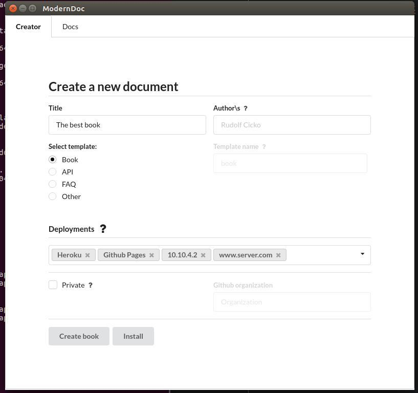

## ModernDoc - desktop cross-platform app (Linux, Windows and Mac).

ModernDoc is a desktop app written in Javascript using the Electron library. It uses semantic-ui that is a framework to create responsive interface design using HTML/CSS.

### Dependencies

| Name         | Version                          |
|--------------|----------------------------------|
| npm           | >= 5.x.x                        |
| node | >= 8.x.x |

### Screenshot

